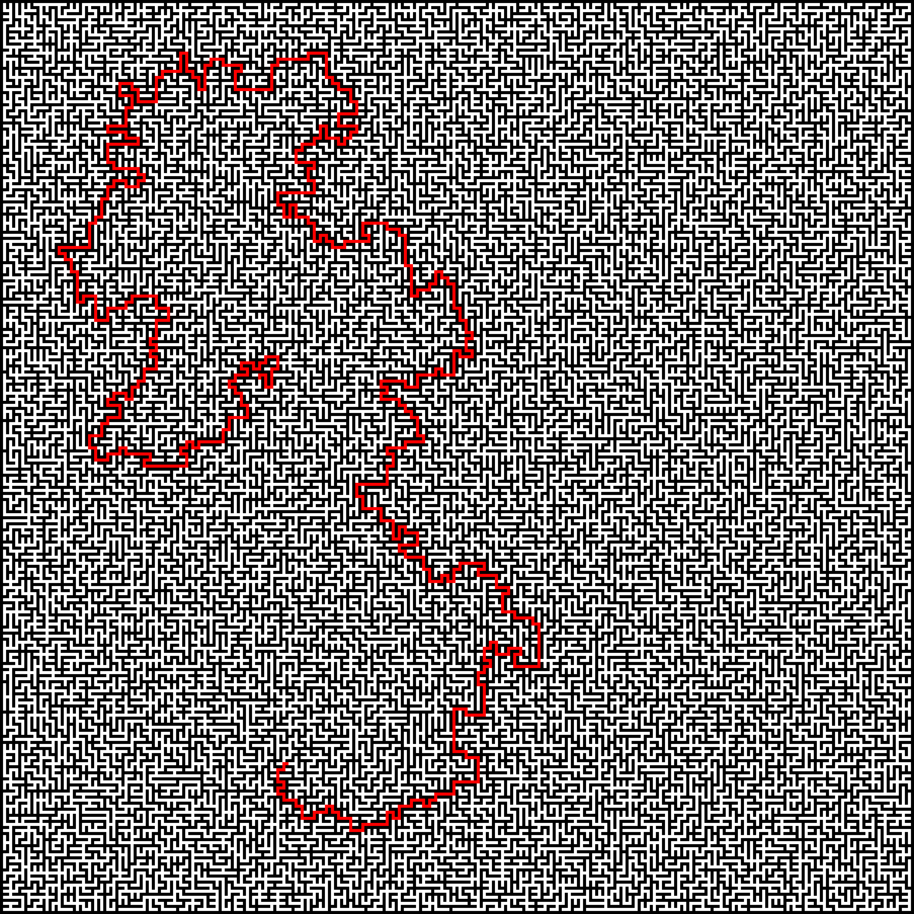

# Maze generator using Kruskal and Dijkstra algorithm

Для компиляции программы должна быть установлена библиотека компьютерного зрения OpenCV, 
чтобы преобразовать полученное поле лабиринта в изображение
Помимо библиотеки должны быть решены все необходимые зависимости 

### Использование происходит с помощью вызова программы и передачи ей необходимых параметров

#### -h, --help     - получение справки о ключах
#### -s, --size     - указание размера лабиринта
#### -p, --path     - указание каталога для итоговых изображений лабиринта
#### --start-finish - указание начальной и конечной точки для решения пути

